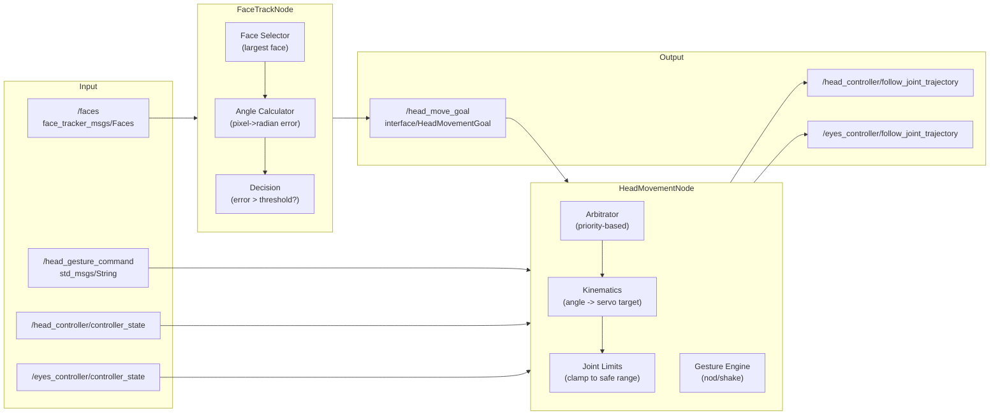

# behaviour

Robot behaviour package. Decides how the robot reacts to data received from the perception package.

## FaceTrackNode

Converts detected face positions into movement commands.

**Subscribes to:**
- `/faces` (`face_tracker_msgs/Faces`) – detected faces

**Publishes on:**
- `/head_move_goal` (`interface/HeadMovementGoal`) – movement command for head/eyes

**Operation:**
1. Selects the largest face to track
2. Calculates angular error between face and camera center
3. If error > `head_movement_threshold`: sends head movement command
4. Otherwise: sends eye movement command for precise tracking

### ROS2 Parameters

| Parameter | Type | Default | Description |
|-----------|------|---------|-------------|
| `camera_diagonal_fov` | double | 1.19555 | Camera diagonal FOV (rad) |
| `camera_resolution_x` | int | 1280 | Camera width (px) |
| `camera_resolution_y` | int | 960 | Camera height (px) |
| `coeff_head_pan` | double | -1.04387 | Camera-to-head_pan servo coefficient |
| `priority_face_track` | int | 2 | Face tracking priority |
| `tracking_goal_min_interval` | double | 0.1 | Minimum interval between movement commands (s) |
| `head_movement_threshold` | double | 0.15 | Angular threshold for head movement (rad) |

## HeadMovementNode

Receives movement commands and controls the robot's head and eyes via `FollowJointTrajectory` actions.

**Subscribes to:**
- `/head_move_goal` (`interface/HeadMovementGoal`) – movement commands
- `/head_gesture_command` (`std_msgs/String`) – gesture commands (`nod`, `shake`)
- `/head_controller/controller_state` – head joint state
- `/eyes_controller/controller_state` – eye joint state

**Action clients:**
- `/head_controller/follow_joint_trajectory`
- `/eyes_controller/follow_joint_trajectory`

**Priority-based arbitration:**
- 3 = GESTURE (highest priority)
- 2 = FACE_TRACK (face tracking)
- 1 = IDLE (lowest priority)

**Operation:**
1. Converts angular error to absolute joint targets
2. Applies joint limits
3. Sends trajectory to the appropriate controller
4. Supports gestures: shake and nod

### ROS2 Parameters

| Parameter | Type | Default | Description |
|-----------|------|---------|-------------|
| `priority_idle` | int | 1 | Idle priority |
| `priority_face_track` | int | 2 | Track priority |
| `priority_gesture` | int | 3 | Gesture priority |
| `coeff_head_pan` | double | -1.04387 | Head pan coefficient |
| `coeff_head_pitch` | double | -2.67659 | Head pitch coefficient |
| `coeff_eye_horizontal` | double | -2.67659 | Eye horizontal coefficient |
| `coeff_eye_vertical` | double | 4.01489 | Eye vertical coefficient |
| `head_pan_min_rad` | double | -0.7 | Head pan minimum (rad) |
| `head_pan_max_rad` | double | 0.7 | Head pan maximum (rad) |
| `head_pitch_min_rad` | double | -0.3 | Head pitch minimum (rad) |
| `head_pitch_max_rad` | double | 0.3 | Head pitch maximum (rad) |
| `eye_h_min_rad` | double | -0.2 | Eye horizontal minimum (rad) |
| `eye_h_max_rad` | double | 0.2 | Eye horizontal maximum (rad) |
| `eye_v_min_rad` | double | -0.15 | Eye vertical minimum (rad) |
| `eye_v_max_rad` | double | 0.15 | Eye vertical maximum (rad) |
| `head_joint_names` | string[] | [head_pan_joint, head_pitch_joint] | Head joint names |
| `eye_joint_names` | string[] | [eye_horizontal_joint, eye_vertical_joint] | Eye joint names |
| `default_trajectory_duration` | double | 0.3 | Default trajectory duration (s) |

## idle

(Planned) Random idle movements and idle-time behaviour.

## Notes

- Gestures are blocking (time.sleep) – not ideal but functional
- The idle subpackage is reserved for future random movement
