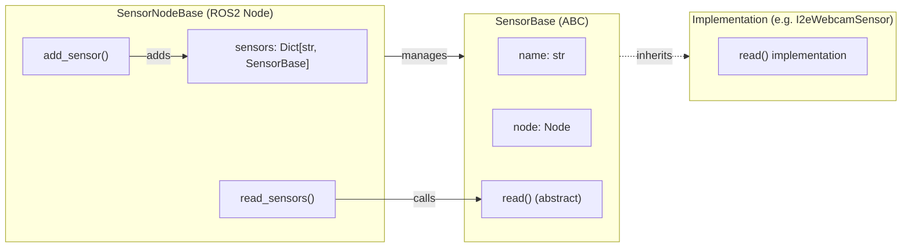

# core

Utility library package providing base classes for sensor nodes.



## SensorBase

Abstract base class for individual sensors. All sensor implementations must inherit this class and implement the `read()` method.

```python
class MySensor(SensorBase):
    def read(self) -> None:
        # Read data and publish it
        pass
```

## SensorNodeBase

ROS2 node that manages multiple `SensorBase` instances. Sensors are added via `add_sensor()` and their `read()` method is triggered via `read_sensors()`.

```python
class MyNode(SensorNodeBase):
    def __init__(self):
        super().__init__("node_name")
        self.add_sensor("sensor_name", MySensor)
        self.create_timer(0.1, self.read_sensors)
```

## util

`run_node(node_class)` – Helper function that initializes rclpy, spins the node, and handles clean shutdown.

## Dependencies

- rclpy
- No other ROS2 packages

## ROS2 Parameters

No own parameters – operates as a library package for other nodes.
