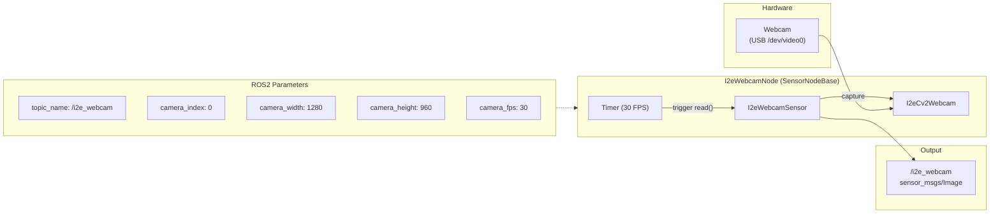

# inmoov_i2

InMoov i2 head and eye sensor nodes. Produces raw data from physical sensors (camera) according to the new data-driven architecture.



## Structure

```
inmoov_i2/
├── i2eyes/       # Eye webcam sensor
└── i2head/       # (Planned) Head servo configuration
```

## i2eyes

### I2eWebcamNode

Webcam sensor node. Publishes camera data for consumption by the perception package.

**Publishes on:**
- `topic_name` (`sensor_msgs/Image`) – raw camera feed (default: `/i2e_webcam`)

### I2eCv2Webcam

Thin OpenCV `VideoCapture` wrapper. Provides `is_valid()` and `close()` methods.

### I2eWebcamSensor

`SensorBase` implementation that reads webcam frames and publishes them as ROS Image messages.

### I2eWebcamNode

`SensorNodeBase` implementation that runs the webcam sensor on a timer.

## ROS2 Parameters

| Parameter | Type | Default | Description |
|-----------|------|---------|-------------|
| `topic_name` | string | `/i2e_webcam` | Publish topic |
| `camera_index` | int | 0 | Camera device index |
| `camera_width` | int | 1280 | Image width |
| `camera_height` | int | 960 | Image height |
| `camera_fps` | int | 30 | Frame rate |

## Notes

- The i2head subpackage is reserved for the i2Head module's servo configuration (YAML-based module definition)
- Webcam is re-initialized if frame reading fails
