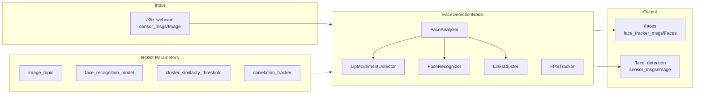

# perception

Face detection package. Subscribes to camera feed, detects faces, analyzes them, and publishes results.

## FaceDetectionNode

Main node performing face detection.

**Subscribes to:**
- `image_topic` (`sensor_msgs/Image`) – raw camera feed (default: `/i2e_webcam`)

**Publishes on:**
- `face_topic` (`face_tracker_msgs/Faces`) – list of detected faces (default: `/faces`)
- `face_image_topic` (`sensor_msgs/Image`) – annotated frame (default: `face_detection`)

**Operation:**
1. Receives camera frame
2. `FaceAnalyzer` detects faces (correlation tracking every 5th frame, full detection on others)
3. Computes face embeddings and runs clustering (`LinksCluster`)
4. Detects speaking from lip movement (`LipMovementDetector`)
5. Publishes results

## FaceAnalyzer

Core class processing a frame and returning a list of known faces. Supports face recognition (DeepFace SFace), correlation tracking (dlib), and speaking detection.

## LipMovementDetector

Keras-based RNN model classifying whether a face is speaking. Based on lip region landmarks (dlib shape predictor 68 landmarks).

## FaceRecognizer

DeepFace wrapper that detects faces in an image and computes embedding vectors.

## LinksCluster

Online clustering algorithm for face recognition. Groups observations of the same person (face_id) using cosine similarity.

## ROS2 Parameters

| Parameter | Type | Default | Description |
|-----------|------|---------|-------------|
| `image_topic` | string | `/i2e_webcam` | Camera image topic |
| `face_image_topic` | string | `face_detection` | Annotated image topic |
| `face_topic` | string | `faces` | Face list topic |
| `lip_motion_model` | string | `1_32_False_True_0.25_lip_motion_net_model.h5` | Lip motion model filename |
| `shape_predictor` | string | `shape_predictor_68_face_landmarks.dat` | Dlib landmark predictor filename |
| `face_recognizer_enabled` | bool | true | Enable face recognition |
| `correlation_tracker` | bool | true | Enable correlation tracking |
| `cluster_similarity_threshold` | double | 0.3 | Cluster similarity threshold |
| `subcluster_similarity_threshold` | double | 0.2 | Subcluster similarity threshold |
| `pair_similarity_maximum` | double | 1.0 | Maximum pair similarity |
| `face_recognition_model` | string | SFace | Recognition model name |
| `face_detection_model` | string | yunet | Detection model name |

## Dependencies

- `face_tracker_msgs` (Faces.msg)
- `core` (node_runner)
- `sensor_msgs/Image`
- deepface, dlib, tensorflow/keras, opencv-python
